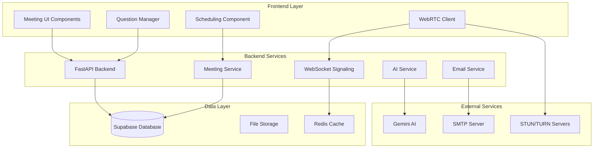
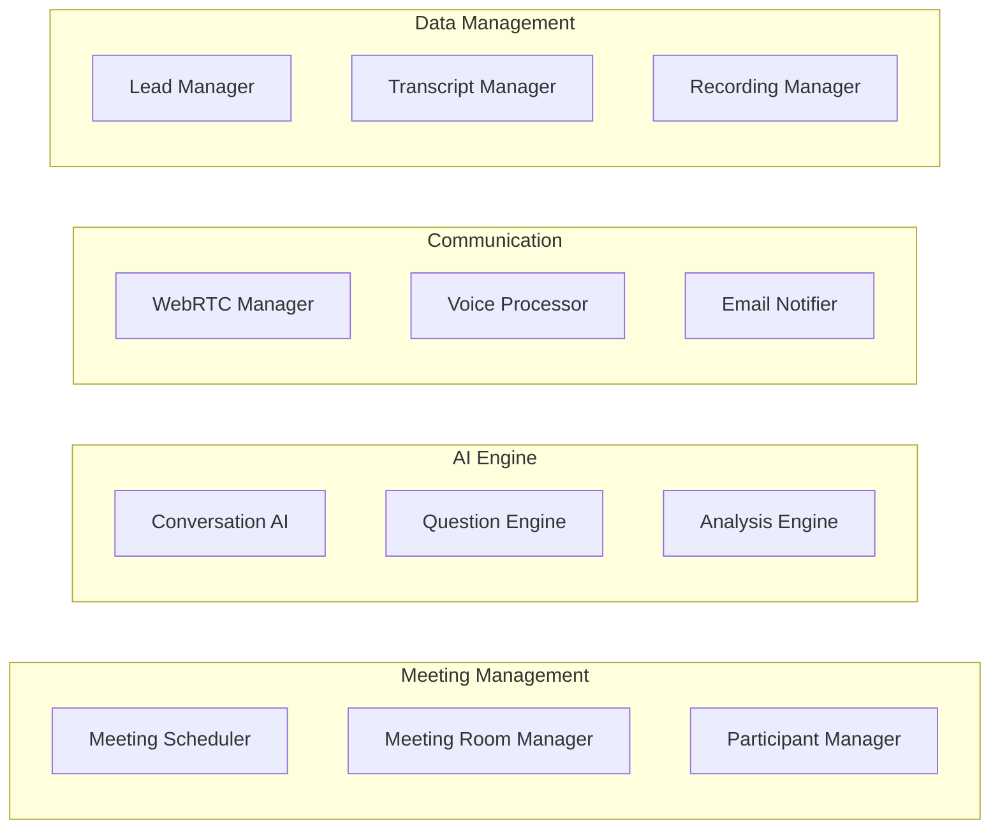

# Enhanced AI Meeting System Design

## Overview

The Enhanced AI Meeting System is a comprehensive solution that enables scheduled AI-powered discovery calls with real-time voice communication, automatic lead analysis, and multi-user participation. The system combines WebRTC technology, AI conversation management, email notifications, and CRM integration to create a seamless sales discovery experience.

## Architecture

### High-Level Architecture



### Component Architecture



## Components and Interfaces

### 1. Meeting Scheduler Component

**Purpose:** Handles scheduling of AI meetings with time selection and participant management.

**Key Methods:**
```typescript
interface MeetingScheduler {
  createScheduledMeeting(leadId: string, dateTime: Date, questionSetId?: string): Promise<ScheduledMeeting>
  updateMeetingTime(meetingId: string, newDateTime: Date): Promise<void>
  cancelMeeting(meetingId: string, reason?: string): Promise<void>
  getMeetingsByDate(date: Date): Promise<ScheduledMeeting[]>
  generateMeetingLink(meetingId: string): string
}
```

**Database Schema:**
```sql
CREATE TABLE scheduled_meetings (
    id UUID PRIMARY KEY DEFAULT gen_random_uuid(),
    user_id UUID REFERENCES auth.users(id),
    lead_id UUID REFERENCES leads(id),
    meeting_room_id VARCHAR(255) UNIQUE NOT NULL,
    scheduled_time TIMESTAMP WITH TIME ZONE NOT NULL,
    duration_minutes INTEGER DEFAULT 60,
    question_set_id UUID REFERENCES question_sets(id),
    status VARCHAR(50) DEFAULT 'scheduled', -- scheduled, active, completed, cancelled
    ai_joined_at TIMESTAMP WITH TIME ZONE,
    participants_joined INTEGER DEFAULT 0,
    created_at TIMESTAMP WITH TIME ZONE DEFAULT NOW(),
    updated_at TIMESTAMP WITH TIME ZONE DEFAULT NOW()
);
```

### 2. Email Notification Service

**Purpose:** Sends automated email notifications for meeting invitations, reminders, and summaries.

**Key Methods:**
```python
class EmailService:
    async def send_meeting_invitation(self, meeting: ScheduledMeeting, recipient: str) -> bool
    async def send_meeting_reminder(self, meeting: ScheduledMeeting, minutes_before: int) -> bool
    async def send_ai_joined_notification(self, meeting: ScheduledMeeting) -> bool
    async def send_meeting_summary(self, meeting: ScheduledMeeting, analysis: dict) -> bool
    async def create_calendar_attachment(self, meeting: ScheduledMeeting) -> bytes
```

**Email Templates:**
- Meeting invitation with calendar attachment
- Meeting reminder (15 minutes before)
- AI joined notification
- Meeting summary with insights

**SMTP Configuration:**
```python
SMTP_SETTINGS = {
    "host": os.getenv("SMTP_HOST", "smtp.gmail.com"),
    "port": int(os.getenv("SMTP_PORT", "587")),
    "username": os.getenv("SMTP_USERNAME"),
    "password": os.getenv("SMTP_PASSWORD"),
    "use_tls": True
}
```

### 3. WebRTC Meeting Room Manager

**Purpose:** Manages real-time audio communication between multiple participants.

**Key Features:**
- Automatic microphone activation with permission
- Voice Activity Detection (VAD)
- Audio mixing for multiple participants
- Fallback to text chat if audio fails

**WebRTC Configuration:**
```typescript
const rtcConfig = {
  iceServers: [
    { urls: 'stun:stun.l.google.com:19302' },
    { urls: 'stun:stun1.l.google.com:19302' },
    { 
      urls: 'turn:your-turn-server.com:3478',
      username: 'turnuser',
      credential: 'turnpass'
    }
  ],
  iceCandidatePoolSize: 10
}
```

**Voice Activity Detection:**
```typescript
interface VoiceActivityDetector {
  startDetection(stream: MediaStream): void
  onVoiceStart: (callback: () => void) => void
  onVoiceEnd: (callback: () => void) => void
  setSensitivity(level: number): void // 0-1, higher = more sensitive
  setAIMode(enabled: boolean): void // Reduces sensitivity when AI is speaking
}
```

### 4. AI Conversation Engine

**Purpose:** Manages AI participation in meetings, including joining, conversation flow, and analysis.

**Key Components:**

**AI Meeting Orchestrator:**
```python
class AIMeetingOrchestrator:
    async def join_scheduled_meeting(self, meeting_id: str) -> bool
    async def wait_for_participants(self, meeting_id: str, timeout_minutes: int = 10) -> bool
    async def start_conversation(self, meeting_id: str) -> str  # Returns opening message
    async def process_user_response(self, meeting_id: str, response: str) -> str
    async def end_meeting_gracefully(self, meeting_id: str) -> dict  # Returns analysis
```

**Question Management:**
```sql
CREATE TABLE question_sets (
    id UUID PRIMARY KEY DEFAULT gen_random_uuid(),
    name VARCHAR(255) NOT NULL,
    description TEXT,
    user_id UUID REFERENCES auth.users(id),
    is_default BOOLEAN DEFAULT false,
    created_at TIMESTAMP WITH TIME ZONE DEFAULT NOW()
);

CREATE TABLE questions (
    id UUID PRIMARY KEY DEFAULT gen_random_uuid(),
    question_set_id UUID REFERENCES question_sets(id),
    question_text TEXT NOT NULL,
    question_type VARCHAR(50) DEFAULT 'open_ended', -- open_ended, multiple_choice, rating
    order_index INTEGER,
    is_active BOOLEAN DEFAULT true,
    created_at TIMESTAMP WITH TIME ZONE DEFAULT NOW()
);
```

**Dynamic Question Engine:**
```python
class QuestionEngine:
    async def generate_contextual_questions(self, lead_data: dict, question_set_id: str) -> List[str]
    async def get_next_question(self, conversation_history: List[dict], remaining_questions: List[str]) -> str
    async def adapt_questions_based_on_responses(self, responses: List[dict]) -> List[str]
```

### 5. Real-Time Analysis Engine

**Purpose:** Analyzes conversations in real-time and updates lead information automatically.

**Analysis Pipeline:**
```python
class ConversationAnalyzer:
    async def analyze_real_time(self, conversation_chunk: str, context: dict) -> dict
    async def generate_final_analysis(self, full_conversation: List[dict], lead_data: dict) -> dict
    async def update_lead_insights(self, lead_id: str, analysis: dict) -> bool
    async def generate_follow_up_tasks(self, analysis: dict) -> List[dict]
```

**Analysis Output Schema:**
```python
@dataclass
class MeetingAnalysis:
    lead_score: int  # 0-100
    qualification_status: str  # qualified, unqualified, needs_follow_up
    key_insights: List[str]
    pain_points: List[str]
    buying_signals: List[str]
    budget_indication: Optional[str]
    timeline_indication: Optional[str]
    decision_makers: List[str]
    next_steps: List[str]
    sentiment_score: float  # -1 to 1
    engagement_level: str  # high, medium, low
    follow_up_priority: str  # urgent, high, medium, low
```

### 6. Recording and Transcription Service

**Purpose:** Records meetings and generates accurate transcripts for analysis and review.

**Recording Manager:**
```python
class RecordingManager:
    async def start_recording(self, meeting_id: str, participants: List[str]) -> str  # Returns recording_id
    async def stop_recording(self, recording_id: str) -> str  # Returns file_path
    async def generate_transcript(self, recording_id: str) -> str
    async def store_recording(self, recording_id: str, retention_days: int = 90) -> bool
```

**Storage Schema:**
```sql
CREATE TABLE meeting_recordings (
    id UUID PRIMARY KEY DEFAULT gen_random_uuid(),
    meeting_id UUID REFERENCES scheduled_meetings(id),
    file_path TEXT NOT NULL,
    file_size_bytes BIGINT,
    duration_seconds INTEGER,
    transcript TEXT,
    transcript_confidence FLOAT,
    created_at TIMESTAMP WITH TIME ZONE DEFAULT NOW(),
    expires_at TIMESTAMP WITH TIME ZONE
);
```

## Data Models

### Core Entities

```sql
-- Enhanced meetings table
ALTER TABLE scheduled_meetings ADD COLUMN IF NOT EXISTS 
    meeting_type VARCHAR(50) DEFAULT 'ai_discovery',
    max_participants INTEGER DEFAULT 10,
    recording_enabled BOOLEAN DEFAULT true,
    transcript_enabled BOOLEAN DEFAULT true,
    email_notifications_enabled BOOLEAN DEFAULT true;

-- Meeting participants tracking
CREATE TABLE meeting_participants (
    id UUID PRIMARY KEY DEFAULT gen_random_uuid(),
    meeting_id UUID REFERENCES scheduled_meetings(id),
    user_id UUID REFERENCES auth.users(id),
    participant_type VARCHAR(50) DEFAULT 'human', -- human, ai
    joined_at TIMESTAMP WITH TIME ZONE,
    left_at TIMESTAMP WITH TIME ZONE,
    audio_enabled BOOLEAN DEFAULT true,
    is_organizer BOOLEAN DEFAULT false
);

-- Real-time conversation tracking
CREATE TABLE conversation_events (
    id UUID PRIMARY KEY DEFAULT gen_random_uuid(),
    meeting_id UUID REFERENCES scheduled_meetings(id),
    speaker_type VARCHAR(50) NOT NULL, -- ai, human
    speaker_id UUID, -- user_id for humans, null for AI
    message_text TEXT NOT NULL,
    audio_duration_ms INTEGER,
    timestamp TIMESTAMP WITH TIME ZONE DEFAULT NOW(),
    confidence_score FLOAT,
    processed BOOLEAN DEFAULT false
);

-- Meeting analysis results
CREATE TABLE meeting_analyses (
    id UUID PRIMARY KEY DEFAULT gen_random_uuid(),
    meeting_id UUID REFERENCES scheduled_meetings(id),
    lead_id UUID REFERENCES leads(id),
    analysis_data JSONB NOT NULL,
    lead_score_before INTEGER,
    lead_score_after INTEGER,
    status_changed_from VARCHAR(50),
    status_changed_to VARCHAR(50),
    created_at TIMESTAMP WITH TIME ZONE DEFAULT NOW()
);
```

## Error Handling

### Meeting Room Errors
- **Connection Failures:** Automatic retry with exponential backoff
- **Audio Issues:** Fallback to text chat mode
- **AI Service Unavailable:** Human moderator notification
- **Participant Limit Exceeded:** Queue system with notifications

### Email Service Errors
- **SMTP Failures:** Retry mechanism with alternative SMTP servers
- **Invalid Email Addresses:** Validation and user notification
- **Rate Limiting:** Queue system with delayed sending

### AI Service Errors
- **API Rate Limits:** Multiple API key rotation
- **Service Timeouts:** Fallback to pre-defined questions
- **Analysis Failures:** Manual review queue

## Testing Strategy

### Unit Tests
- Meeting scheduling logic
- Email template generation
- Question management CRUD operations
- Analysis algorithm accuracy

### Integration Tests
- WebRTC connection establishment
- Email delivery end-to-end
- AI service integration
- Database transaction integrity

### End-to-End Tests
- Complete meeting flow from scheduling to analysis
- Multi-user meeting participation
- Email notification delivery
- Lead data updates after meeting completion

### Performance Tests
- Concurrent meeting capacity
- Audio quality under load
- Database query performance
- Email sending throughput

### User Acceptance Tests
- Meeting scheduling user experience
- Voice communication quality
- AI conversation naturalness
- Analysis accuracy and usefulness

## Security Considerations

### Data Protection
- End-to-end encryption for audio streams
- Secure storage of meeting recordings
- GDPR compliance for conversation data
- User consent management for recordings

### Access Control
- Meeting room access via secure tokens
- User authentication for all operations
- Role-based permissions for question management
- Audit logging for all meeting activities

### Privacy
- Automatic data retention policies
- User control over recording preferences
- Anonymization options for sensitive conversations
- Secure deletion of expired recordings